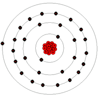

# How-to-do-anything? :rocket::mortar_board:

>  ## *Notable*

   ```

   LearnXinYminutes - learnxinyminutes.com/
   Explorable Explanations - https://explorabl.es/
   Build your own X - https://github.com/danistefanovic/build-your-own-x
   explain that stuff - explainthatstuff.com
   how stuff works - howstuffworks.com
   0x00sec.org
   news.ycombinator.com
   
   ```
   
   browse the man pages:
   ```
   apropos . | awk '{print $1}' | grep '(#sectionIdHere)'
   ```
   Sections of the manual pages
       The manual Sections are traditionally defined as follows:

       1 User commands (Programs)
              Commands that can be executed by the user from within a shell.

       2 System calls
              Functions which wrap operations performed by the kernel.

       3 Library calls
              All library functions excluding the system call wrappers (Most
              of the libc functions).

       4 Special files (devices)
              Files found in /dev which allow to access to devices through
              the kernel.

       5 File formats and configuration files
              Describes various human-readable file formats and
              configuration files.

       6 Games
              Games and funny little programs available on the system.

       7 Overview, conventions, and miscellaneous
              Overviews or descriptions of various topics, conventions and
              protocols, character set standards, the standard filesystem
              layout, and miscellaneous other things.

       8 System management commands
              Commands like mount(8), many of which only root can execute.

## Table of contents
* [Notable](https://github.com/ophionB/How-to-do-anything-/blob/master/README.md#notable)
* [Computer Science](https://github.com/ophionB/How-to-do-anything-/blob/master/README.md#computer-science)
   - [Algorithms](https://github.com/ophionB/How-to-do-anything-/blob/master/README.md#algorithms)
   - [Design Patterns](https://github.com/ophionB/How-to-do-anything-/blob/master/README.md#design-patterns)
* [C](https://github.com/ophionB/How-to-do-anything-/blob/master/README.md#c)
* [Java](https://github.com/ophionB/How-to-do-anything-/blob/master/README.md#java)
* [Kotlin](https://github.com/ophionB/How-to-do-anything-/blob/master/README.md#kotlin)
* [Finance](https://github.com/ophionB/How-to-do-anything-/blob/master/README.md#finance)
   - [Management](https://github.com/ophionB/How-to-do-anything-/blob/master/README.mdxf#management)
   - [Trading](https://github.com/ophionB/How-to-do-anything-/blob/master/README.md#trading)
* [News & Communities](https://github.com/ophionB/How-to-do-anything-/blob/master/README.md#news--communities)
* [Human behavior & Psychology](https://github.com/ophionB/How-to-do-anything-/blob/master/README.md#human-behavior--psychology)
* [Privacy & Security](https://github.com/ophionB/How-to-do-anything-/blob/master/README.md#privacy--security)
* [Home Automation](https://github.com/ophionB/How-to-do-anything-/blob/master/README.md#home-automation)
* [DIY](https://github.com/ophionB/How-to-do-anything-/blob/master/README.md#diy)


## Computer Science
 - https://en.wikipedia.org/wiki/Computer
 - All computer Glossaries - https://en.wikipedia.org/wiki/Category:Glossaries_of_computers
 - Glossary of Computer Science - https://en.wikipedia.org/wiki/Glossary_of_computer_science
 - Glossary of computer hardware terms - https://en.wikipedia.org/wiki/Glossary_of_computer_hardware_terms
 - Computer Science from the bottom up - https://www.bottomupcs.com/
   - > Author: Yes as pointed out many times not 
"computer science" and I somewhat regret the name.  However, it came out
 of me being a teaching assistant for people doing computer science 
degrees.  A surprising number of people got to 3rd year operating 
systems courses without realising things like 2^10 is a kilobyte, 2^20 
is a megabyte, etc.  Let alone how a program was linked and loaded.  I 
hope for this to be helpful, there are plenty of similar resources but 
sometimes the way one person says something resonates more than another.
- Object Oriented programming - https://en.wikipedia.org/wiki/Object-oriented_programming
  - OOP is basically a struct containing function pointers, Objects can contain other objects in their instance variables; this is known as object composition.
  For example, an object in the Employee class might contain (either 
directly(inheritance) or through a pointer(Variable assigned to object) an object in the Address class, in 
addition to its own instance variables like "first_name" and "position".
  Object composition is used to represent "has-a" relationships: every 
employee has an address, so every Employee object has access to a place 
to store an Address object (either directly embedded within itself, or 
at a separate location addressed via a pointer).
- How computer memory works - https://www.explainthatstuff.com/how-computer-memory-works.html
-  https://en.wikipedia.org/wiki/Virtual_address_space
   - virtual address space (VAS) or address space is the set of ranges of virtual addresses that an operating system makes available to a process
- File Descriptors - 'man fd' explains where the descriptors are stored - https://www.bottomupcs.com/file_descriptors.xhtml
  - File Control - 'man fcntl' provides information about control over file descriptors.
### Architecture
> A general purpose computer has four main components: the arithmetic logic unit (ALU), the control unit, the memory, and the input and output devices (collectively termed I/O). These parts are interconnected by buses, often made of groups of wires.
Inside each of these parts are thousands to trillions of small electrical circuits which can be turned off or on by means of an electronic switch. Each circuit represents a bit
 (binary digit) of information so that when the circuit is on it 
represents a "1", and when off it represents a "0" (in positive logic 
representation). The circuits are arranged in logic gates so that one or more of the circuits may control the state of one or more of the other circuits.

- Program Counter / Instruction Pointer - https://en.wikipedia.org/wiki/Program_counter

  - > the instruction counter,[2] or just part of the instruction sequencer,[3] is a processor register    that indicates where a computer is in its program sequence

- ISA Instruction Set Architecture - https://en.wikipedia.org/wiki/Instruction_set_architecture

- Microarchitecture - https://en.wikipedia.org/wiki/Microarchitecture

#### Memory
> In a semiconductor memory chip, each bit of binary data is stored in a tiny circuit called a memory cell consisting of one to several transistors.
  The memory cells are laid out in rectangular arrays on the surface of 
the chip.  The 1-bit memory cells are grouped in small units called words which are accessed together as a single memory address. Memory is manufactured in word length that is usually a power of two, typically N=1, 2, 4 or 8 bits. Data is accessed by means of a binary number called a memory address
 applied to the chip's address pins, which specifies which word in the 
chip is to be accessed.  If the memory address consists of M bits, the number of addresses on the chip is 2M, each containing an N bit word.   Consequently, the amount of data stored in each chip is N2M bits.[5]  The memory storage capacity for M number of address lines is given by 2M, which is usually in power of two: 2, 4, 8, 16, 32, 64, 128, 256 and 512  and measured in kibibits, mebibits, gibibits or tebibits, etc. As of 2014
 the largest semiconductor memory chips hold a few gibibits of data, but
 higher capacity memory is constantly being developed.    By combining 
several integrated circuits, memory can be arranged into a larger word 
length and/or address space than what is offered by each chip, often but
 not necessarily a power of two.[5]
 The two basic operations performed by a memory chip are "read", in which the data contents of a memory word is read out (nondestructively), and "write"
 in which data is stored in a memory word, replacing any data that was 
previously stored there.  To increase data rate, in some of the latest 
types of memory chips such as DDR SDRAM multiple words are accessed with each read or write operation.

- Semiconductor Memory - https://en.wikipedia.org/wiki/Semiconductor_memory
- Memory cell - https://en.wikipedia.org/wiki/Memory_cell_(computing)

### Algorithms
> - Complexity - https://en.wikipedia.org/wiki/Analysis_of_algorithms
- Pathfinding Demystified - https://gabrielgambetta.com/generic-search.html
### Networking
All Protocols - https://en.wikipedia.org/wiki/Category:Application_layer_protocols
> A Summary of what networking is: Hosts on the ethernet (Connected by wires) checking their cached ARP tables for an already resolved ip to mac adress, if found we send the ethernet packet, if it does not, we send a recursive ARP(address resolution protocol) packet. An ARP packet requests to resolve an IP Adress to an interfaces Mac Adress(Where is 192.168.xx.xx? Tell 192.168.source.ip) on its ethernet network. The gateway / Router's task is to recursively request and reply until the destination IP Adress has been reached and replied to our request. The Packet e.g. "Internet Protocol(Ether Type: 0800)" is located entirely within the Ethernets payload, the payloads protocol type however is identified by the defined "Ether Type" e.g. 0800 Represents "Internet Protocol (IP)". The "Internet Protocol" Than recursively encapsulates information about the protocol used to send the information contained in its own payload for example TCP, TCP includes Byte Streams(3 way hand shake) to prevent Packet Loss, Reordering etc. Something you see often in networking is a "protocol" encapsulating another "protocol". In-Depth Explanation: https://www.youtube.com/watch?v=xNbdeyEI-nE.
> Internet communication protocols are published by the Internet Engineering Task Force (IETF). The IEEE handles wired and wireless networking, and the International Organization for Standardization (ISO) handles other types. The ITU-T handles telecommunication protocols and formats for the public switched telephone network (PSTN). As the PSTN and Internet converge, the standards are also being driven towards convergence

- > /usr/includes/net & /usr/includes/netinet contain all the header files of the internet protocols.
- Network Interface Controller - https://en.wikipedia.org/wiki/Network_interface_controller
- PHY - https://en.wikipedia.org/wiki/PHY
  > A PHY, an abbreviation for "physical layer", is an electronic circuit, usually implemented as an integrated circuit, required to implement physical layer functions of the OSI model in a network interface controller, the Ethernet PHY is a chip that implements the hardware send and receive function of Ethernet frames.
- Packets - https://en.wikipedia.org/wiki/Network_packet
- Packet Switching - https://en.wikipedia.org/wiki/Packet_switching
  - Packet switching is a method of grouping data that is transmitted over a digital network into packets. Packets are made of a header and a payload.
 Data in the header are used by networking hardware to direct the packet
 to its destination where the payload is extracted and used by application software. Packet switching is the primary basis for data communications in computer networks worldwide.

- Network Socket - [READ ENTIRE PAGE](https://en.wikipedia.org/wiki/Network_socket)
- Protocol Stack - https://en.wikipedia.org/wiki/Protocol_stack
  - > A protocol stack, today usually provided by the operating system
 (rather than as a separate library, for instance), is a set of services
 that allow processes to communicate over a network using the protocols 
that the stack implements. The operating system forwards the payload of 
incoming IP packets to the corresponding application by extracting the 
socket address information from the IP and transport protocol headers 
and stripping the headers from the application data.
- Protocol Data Unit - https://en.wikipedia.org/wiki/Protocol_data_unit
- OSI model - https://en.wikipedia.org/wiki/OSI_model
- Berkeleys Standard (Most API's are based on Berkley's Standard) -  https://en.wikipedia.org/wiki/Berkeley_sockets
  - > **This page goes super in-depth and expands on how to setup your first TCP Client > Server connection.**
- Packet sizes
         
         Yes, Packet size affect performance of network a lot.

         First
          and foremost, every medium of transmission specifies MTU ie maximum 
         transmission unit. If packet is more than MTU, it will be dropped.
         Now question is how?

         There
          is something called bandwith i.e maximum number of bits per second in 
         order to guarantee reasonable level of reliability. Packet is single 
         unit and considered to be transferred over small time. 
         A larger 
         packet will take long time to transfer resulting into more collisions at
          Layer 1. The medium of transmission i.e copper wire or twisted pair 
         transfer electrons based on their mobility. This restriction affects the
          rate of data transfer over them. A large packet would mean others wont 
         get chance to use transmission line
         Apart from this restriction, 
         buffers on NIC and OS have memory size restriction. A large packet size 
         would mean large memory allocation at intermediate boxes as well as end 
         hosts. If your packet size is large in high probability it will get 
         dropped at queue whose element size is small or in worst case get 
         fragmented (which is more computationally intensive then re transmitting
          in form of small packets).

         A small packet size means large header content thus useful information would form less percentage of actual data transfer.
         1000 byte data - as 1 packet - 1000+40(header) = 1040
         1000 byte data as 20 packets - 1000+ 40*20 =     1800 byte.
         Thus smaller packet size makes network inefficient by pumping more useless bits  an congesting it.
         Thus standard size is set to 512 bytes, Ethernet has set up 1500 bytes. in advanced interfaces, it could go till 9000 bytes too

### Design Patterns
*Basic principles*
- ```
  Keep It Simple Stupid Principle - https://en.wikipedia.org/wiki/KISS_principle
  You aren't gonna need it Principle - https://en.wikipedia.org/wiki/You_aren%27t_gonna_need_it
  Emergent Design - https://en.wikipedia.org/wiki/Emergent_Design
  ```
 *Commonly used & use case*
 - ```
   Builder - While Writing Unit Tests
   Prototype - Cloning
   Adapter - asList , toString
   Chain Of Responsibility - Exception handling, logging
   Singleton
   Factory - Action Mapping
   Proxy
   Observer - Event Listener
   MVC - Web frameworks
   Filter - Criteria
   ```
- Java design patterns - https://github.com/iluwatar/java-design-patterns


## Programming
#### C
 - C Syntax - https://en.wikipedia.org/wiki/C_syntax
 - C Preprocessors - https://en.wikipedia.org/wiki/C_preprocessor
 - Include Guards (prevent double header variables caused byrecursive inclusion) - https://en.wikipedia.org/wiki/Include_guard
 - Make - https://www.gnu.org/software/make/manual/make.html
 - Simple Client/Server connecting - https://github.com/TheAlgorithms/C/tree/master/Simple%20Client%20Server
 - Object-Oriented Programming in ANSI C - https://www.cs.rit.edu/~ats/books/ooc.pdf
   - > Must Read!
 - C runs on a Abstract Machine Model - https://words.steveklabnik.com/should-you-learn-c-to-learn-how-the-computer-works
   - > Explains on why C and Java are not really that different i.e. of the virtual machine.
       ANSI C(C89) is written in the same year as the ANSI Standard which is why it's portable to most machines.
       C is however executed on an Abstract machine model and therefore not the actual Computer architecture.
       
#### JAVA
- Summary of Creating & Using Classes & Objects - https://docs.oracle.com/javase/tutorial/java/javaOO/summaryclasses.html
- The Really Big Index - https://docs.oracle.com/javase/tutorial/reallybigindex.html
- The Java Whitepaper 1996 (A summary of the transition from C to Java) - http://journals.ecs.soton.ac.uk/java/whitepaper/java-whitepaper-1.html
- Learn about annotations - https://en.wikipedia.org/wiki/Java_annotation
- Java is awesome - https://github.com/akullpp/awesome-java

#### KOTLIN
 - Learn kotlin in *Y* Minutes https://learnxinyminutes.com/docs/kotlin/

#### SQL
- https://en.wikipedia.org/wiki/Database_index
  - > The primary purpose of an index is to provide an ordered representation 
of the indexed data. It is, however, not possible to store the data 
sequentially because an insert statement 
would need to move the following entries to make room for the new one. 
Moving large amounts of data is very time-consuming so the insert
 statement would be very slow. The solution to the problem is to 
establish a logical order that is independent of physical order in 
memory.

## Web Development
 > Use alot of random yet relative text, alot of variations, and depending on the project alot of Emoji's
- All Emojis -  https://www.w3schools.com/charsets/ref_emoji.asp
- Http-Cookies - https://en.wikipedia.org/wiki/HTTP_cookie
  - > An HTTP cookie (also called web cookie, Internet cookie, browser cookie, or simply cookie) is a small piece of data sent from a website and stored on the user's computer by the user's web browser while the user is browsing. Cookies were designed to be a reliable mechanism for websites to remember stateful information (such as items added in the shopping cart in an online store) or to record the user's browsing activity (including clicking particular buttons, logging in, or recording which pages were visited in the past). They can also be used to remember arbitrary pieces of information that the user previously entered into form fields such as names, addresses, passwords, and credit-card numbers.

Cookies perform essential functions in the modern web. Perhaps most importantly, authentication cookies are the most common method used by web servers to know whether the user is logged in or not, and which account they are logged in with. Without such a mechanism, the site would not know whether to send a page containing sensitive information, or require the user to authenticate themselves by logging in. The security of an authentication cookie generally depends on the security of the issuing website and the user's web browser, and on whether the cookie data is encrypted. Security vulnerabilities may allow a cookie's data to be read by a hacker, used to gain access to user data, or used to gain access (with the user's credentials) to the website to which the cookie belongs (see cross-site scripting and cross-site request forgery for examples).[1]

#### CSS
- All Selectors - https://www.w3schools.com/cssref/css_selectors.asp
- Learn to layout - https://learnlayout.com/
- everything you need to know - https://learn.shayhowe.com/html-css/
- HTML - https://developer.mozilla.org/en-US/docs/Web/Guide/HTML/HTML5

#### JAVASCRIPT
- Parcel - Fast, zero-configuration web application bundler - https://parceljs.org/
- Libraries & Frameworks - https://www.javascripting.com
- AJAX - https://en.wikipedia.org/wiki/Ajax_(programming)
  - > Ajax (also AJAX /ˈeɪdʒæks/; short for "Asynchronous JavaScript and XML")[1][2] is a set of web development techniques using many web technologies on the client side to create asynchronous web applications. With Ajax, web applications can send and retrieve data from a server asynchronously (in the background) without interfering with the display and behavior of the existing page. By decoupling the data interchange layer from the presentation layer, Ajax allows web pages and, by extension, web applications, to change content dynamically without the need to reload the entire page.[3] In practice, modern implementations commonly utilize JSON instead of XML.

Ajax is not a single technology, but rather a group of technologies. HTML and CSS can be used in combination to mark up and style information. The webpage can then be modified by JavaScript to dynamically display—and allow the user to interact with—the new information. The built-in XMLHttpRequest object, or since 2017 the new "fetch()" function within JavaScript, is commonly used to execute Ajax on webpages allowing websites to load content onto the screen without refreshing the page. Ajax is not a new technology, or different language, just existing technologies used in new ways. 

- XmlHttpRequest - https://en.wikipedia.org/wiki/XMLHttpRequest
  - > XMLHttpRequest (XHR) is an API in the form of an object whose methods transfer data between a web browser and a web server. The object is provided by the browser's JavaScript environment. Particularly, retrieval of data from XHR for the purpose of continually modifying a loaded web page is the underlying concept of Ajax design. Despite the name, XHR can be used with protocols other than HTTP and data can be in the form of not only XML,[1] but also JSON,[2] HTML or plain text.[3] 


## Commercial Development Tools
Topics about tools:</br>
https://news.ycombinator.com/item?id=22786853

### Keycloak
https://www.keycloak.org/</br>
Add authentication to applications and secure services with minimum fuss. No need to deal with storing users or authenticating users. It's all available out of the box.                
You'll even get advanced features such as User Federation, Identity Brokering and Social Login.

### Hasura
https://hasura.io/</br>
Hasura by far, lets you point-and-click build your database and table relationships with a web dashboard and autogenerates a full GraphQL CRUD API with permissions you can configure and JWT/webhook auth baked-in.

I've been able to build in a weekend no-code what would've taken my team weeks or months to build by hand, even with something as productive as Rails. It automates the boring stuff and you just have to write single endpoints for custom business logic, like "send a welcome email on sign-up" or "process a payment".

It has a database viewer, but it's not the core of the product, so I use Forest Admin to autogenerate an Admin Dashboard that non-technical team members can use.

For interacting with Hasura from a client, you can autogenerate fully-typed & documented query components in your framework of choice using GraphQL Code Generator:</br>
https://graphql-code-generator.com/

### Forest Admin
https://www.forestadmin.com/</br>
With Forest Admin & Hasura, you can point-and-click make 80% of a SaaS product in almost no time.
I wrote a tutorial on how to integrate Hasura + Forest Admin, for anyone interested:</br>
http://hasura-forest-admin.surge.sh

### retool
https://retool.com</br>
Retool cuts the time it takes to build internal tools in half so you can focus on what matters

### Metabase
https://metabase.com</br>
Metabase is an open source business intelligence tool. It lets you ask questions about your data, and displays answers in formats that make sense, whether that’s a bar graph or a detailed table.

### Adalo
https://www.adalo.com
Create IOS & Android apps with a no-code tool that is as powerful as code.


## Privacy, Security, Hacking, Anonimity & Forensics
- <b>Communities</b>
  - privacytools.io - Privacy information
  - thatoneprivacysite.com - Indepedent comparison site.
  - inteltechniques.com - OSINT && Privacy by Michael Bazzell
  - 0x00sec.org
  
### Privacy & Anonimity  
> Re-route and tunnel all connections on all devices to your home network through 'WireGuard' containing a net wide adblocker 'Pi-Hole' and 'VPN' over router, Use a trusted DNS resolver using Http-over-dns, use a 7-Layer Firewall named 'Little Snitch' to control incoming & outgoing packets. Spoof your 'MAC' adress & Randomize hostname and local ip on every boot, Use 'FireFox' or 'TOR' to browse the internet.
#### DNS
 > The Domain Name System (DNS) is a hierarchical and decentralized naming system for computers and comes down to resolving the domain(i.e. https://sub.second-level-domain.tld) to its servers IP adress, This is done by your computer or DNS Resolver requesting a 'Root DNS server' (https://root-servers.org/) for an IP adress that knows more about the requested 'Top Level Domains' i.e 'com' 'org' etc... this would than reply with an IP adress of a 'Top Level Domain Name Server' that knows more about its registered second-level-domains & requests the IP of the second-level-domain. in the case of an sub domain the domain's name server (authorative server) would be able to tell the resolver which IP address has the HTML files for the site. This process is called recursive resolution, because you have to go back and forth asking different servers what’s basically the same question.
 
 - A cartoon introduction to DNS over HTTPS - https://hacks.mozilla.org/2018/05/a-cartoon-intro-to-dns-over-https/
 
 | Exploits | Fixes |
 |  :---:   | :---: |
 |You could end up using an untrustworthy resolver that tracks your requests, or tampers with responses from DNS servers. | Avoid untrustworthy resolvers by using Trusted Recursive Resolver.|
 | On-path routers can track or tamper in the same way. | Protect against on-path eavesdropping and tampering using DNS over HTTPS. |
 | DNS servers can track your DNS requests. | Transmit as little data as possible to protect users from deanonymization. |
 
##### How can DNS be exploited?
So how can this system make users vulnerable?
Usually a resolver will tell each Domain Name System Server what domain you are 
looking for. This request sometimes includes your full IP address. Or if not your full IP address, increasingly often the request includes most of your IP address, which can easily be combined with other information to figure out your identity.

##### Tracking
Like I said above, it’s easy to take the full or partial IP address info and figure out who’s asking for that web site. This means that the DNS server and anyone along the path to that DNS server — called on-path routers — can create a profile of you. They can create a record of all of the web sites that they’ve seen you look up.
And that data is valuable. Many people and companies will pay lots of money to see what you are browsing for.

Even if you didn’t have to worry about the possibly nefarious DNS servers or on-path routers, you still risk having your data harvested and sold. That’s because the resolver itself — the one that the network 
gives to you — could be untrustworthy.

Even if you trust your network’s recommended resolver, you’re probably only using that resolver when you’re at home. Like I mentioned before, whenever you go to a coffee shop or hotel or use any other network, you’re probably using a different resolver. And who knows what its data collection policies are?

##### Spoofing
With spoofing, someone on the path between the DNS server and you changes the response. Instead of telling you the real IP address, a spoofer will give you the wrong IP address for a site. This way, they can block you from visiting the real site or send you to a scam one.

Again, this is a case where the resolver itself might act nefariously.

For example, let’s say you’re shopping for something at Megastore. You want to do a price check to see if you can get it cheaper at a competing online store, big-box.com.

But if you’re on Megastore WiFi, you’re probably using their resolver. That resolver could hijack the request to big-box.com and lie to you, saying that the site is unavailable.

### Hacking
- <b>Tools:</b>
   - Burpsuite - https://portswigger.net/burp
     - > Burp Suite Community Edition is a feature-limited set of manual tools 
         for exploring web security. Proxy your HTTPS traffic, edit and repeat 
         requests, decode data, and more.
- Man-in-the-middle attack - https://en.wikipedia.org/wiki/Man-in-the-middle_attack

### Cryptography    
- Graduate Course in Applied Cryptography - https://toc.cryptobook.us/
- Post-quantum cryptography - https://en.wikipedia.org/wiki/Post-quantum_cryptography
    - > Post-quantum cryptography (sometimes referred to as quantum-proof, quantum-safe or quantum-resistant) refers to cryptographic algorithms (usually public-key algorithms) that are thought to be secure against an attack by a quantum computer. As of 2019,
 this is not true for the most popular public-key algorithms, which can 
be efficiently broken by a sufficiently strong quantum computer. The 
problem with currently popular algorithms is that their security relies 
on one of three hard mathematical problems:  the integer factorization problem, the discrete logarithm problem or the elliptic-curve discrete logarithm problem. All of these problems can be easily solved on a sufficiently powerful quantum computer running Shor's algorithm.[1][2] 

### Intelligence / Forensic / OSINT
List of intelligence gathering disciplines - https://en.wikipedia.org/wiki/List_of_intelligence_gathering_disciplines


## Physics
##### Molecule:
> All matter such as solids, liquids, and gases, is composed of atoms.
 Therefore, the atom is considered to be the basic building block of 
matter. However, atoms are almost always grouped together with other 
atoms to form what is called a molecule. Only a few gases such as helium
 are composed of individual atoms as the structural unit. 
##### Element:
- The periodic table, also known as the periodic table of elements, is a tabular display of the chemical elements, which are arranged by atomic number, electron configuration, and recurring chemical properties. - https://en.wikipedia.org/wiki/Periodic_table
> Any material that is composed of only one type of atom is called a chemical element, a basic element, or just an element. Any material that is composed of more than one type of atom is called a compound.
 Every element has a unique atomic structure. Scientists know of only 
about 109 basic elements at this time. (This number has a habit of 
changing.) All matter is composed of combinations of one or more of 
these elements. Ninety-one of these basic elements occur naturally on or
 in the Earth. The other elements are man-made. You may recognize the 
names of some of these basic elements, such as: hydrogen, helium, 
oxygen, iron, copper, gold, aluminum, uranium. The periodic table of 
elements (shown below) lists the basic elements and some of their 
properties.
### Electromagnetism
<b>Current/Amperage:</b> An electric current is the rate of flow of electric charge past a point[1]:2[2]:622 or region.[2]:614 An electric current is said to exist when there is a net flow of electric charge through a region.</br>
<b>Voltage:</b> Voltage, electric potential difference, electric pressure or electric tension is the difference in electric potential between two points. The difference in electric potential between two points (i.e., voltage) in a static electric field is defined as the work needed per unit of charge to move a test charge between the two points.</br>
<b>Resistance:</b> The electrical resistance of an object is a measure of its opposition to the flow of electric current. The inverse quantity is electrical conductance, and is the ease with which an electric current passes. Electrical resistance shares some conceptual parallels with the notion of mechanical friction.</br>
<b>Conductors:</b> conduct electrical current very easily because of their free electrons Some common conductors are copper, aluminum, gold, and silver.</br>
<b>Insulators:</b> oppose electrical current and make poor conductors.Some common insulators are glass, air, plastic, rubber, and wood.</br>
<b>Valence shell</b>: Notice that in the copper atom pictured below that the outside shell has only one electron. This represents that the copper atom has one electron that is near the outer portion of the atom. The outer shell of any atom is called the valence shell. When the valence electron in any atom gains sufficient energy from some outside force, it can break away from the parent atom and become what is called a free electron.
<p align="center">
   
   </p>

- A complete explaination of electical current and how its produced - https://www.nde-ed.org/EducationResources/HighSchool/Electricity/electricalcurrent.htm
  - > This is one of the most thorough explanations of electricty at the atomic level. Aswell as it's explanation on production, traversing & the measurement of electricity.
- Coulombs Law - https://en.wikipedia.org/wiki/Coulomb%27s_law
  - > Coulomb's law, or Coulomb's inverse-square law, is an experimental law[1] of physics that quantifies the amount of force between two stationary, electrically charged particles.  The electric force between charged bodies at rest is conventionally called electrostatic force[2] or Coulomb force.[3]  The quantity of electrostatic force between stationary charges is always described by Coulomb's law.[4]  The law was first published in 1785 by French physicist Charles-Augustin de Coulomb, and was essential to the development of the theory of electromagnetism, maybe even its starting point,[5] because it was now possible to discuss quantity of electric charge in a meaningful way.[6]
- An animated explanation on how Electricity is produced - https://www.saveonenergy.com/how-electricity-works/
- Electric charge -  https://en.wikipedia.org/wiki/Electric_charge
- Electromagnetic Spectrum [ BEST EXPLANATION by NASA ] - https://imagine.gsfc.nasa.gov/science/toolbox/emspectrum1.html

### Radio Waves
#### Frequency Modulation - https://en.wikipedia.org/wiki/Frequency_modulation
> Frequency modulation (FM) is the encoding of information in a carrier wave by varying the instantaneous frequency of the       wave. The term and technology is used in both telecommunications and signal processing. 

### Quantum Mechanics
- Walking with atoms – chemical bond making and breaking recorded in action - https://www.nottingham.ac.uk/news/walking-with-atoms


## FINANCE
#### MANAGEMENT
 - Personal Finance - https://www.reddit.com/r/personalfinance/wiki/commontopics#wiki_graphical_version
#### TRADING
 - VTSAX  - Mutual Index Fund - https://www.youtube.com/watch?v=ftMOJm8HXqk<br/>
   - > VTSAX is a Mutual Index Fund, Mutual meaning a combination of other indexes (e.g. Dow Jones) i.e. you're investing in the entire stock market, which grows as the economy inflates.


## NEWS & COMMUNITIES
 > All the news sources here are legitimate and very informative resources of information.
 - 0x00sec - 0x00sec.org
 - Hacker News - news.ycombinator.com
 - The Economist - economist.com<br/>
   - > 1. It's weekly. "World this week" section is more than enough to have a summary of what has happened throughout the globe and I can get this information in less than 5 minutes. If you are interested in being more up-to-date, you can also try Economist Espresso, which is daily.<br/>
   - > 2. It's not only about world news, but also has different sections such as Technology, International, Book & Arts which gives me a wider range of topics to digest on a weekly basis.
 - The Well - https://www.well.com/ - :dollar:
 - Hackaday - https://hackaday.com/
 - Slashdot - https://slashdot.org/
 - Lobsters - https://lobste.rs/
 
 
 ## Human behavior & Psychology
 - Tiny Habits - Tinyhabits.com
   - > The Tiny Habits habit formation 
regime created by Stanford researcher BJ Fogg. A lot of the addictive 
design patterns you see in apps like Snapchat, Instagram, etc. are built
 off his research. Quite nefarious use of psychology for 
advertising/“engagement”, but the plus side is you can use the same 
strategies to build habits you want to build.
- Epistemology - https://en.wikipedia.org/wiki/Epistemology
  - > Epistemology is the study of the nature of knowledge, justification, and
 the rationality of belief. Much debate in epistemology centers on four 
areas: (1) the philosophical analysis of the nature of knowledge and how it relates to such concepts as truth, belief, and justification,[1][2] (2) various problems of skepticism,
 (3) the sources and scope of knowledge and justified belief, and (4) 
the criteria for knowledge and justification. Epistemology addresses 
such questions as: "What makes justified beliefs justified?",[3] "What does it mean to say that we know something?",[4] and fundamentally "How do we know that we know?"[5]
- https://en.wikipedia.org/wiki/List_of_cognitive_biases - Cognitive biases are systematic patterns of deviation from norm or rationality in judgment


## Home Automation
- Home Assistant - https://www.home-assistant.io/
  - > Open source home automation that puts local control and privacy first. 
Powered by a worldwide community of tinkerers and DIY enthusiasts. 
Perfect to run on a Raspberry Pi or a local server.


## Music
- Waveforms - https://pudding.cool/2018/02/waveforms/
  - > An audio wave is the vibration of air
molecules, which is how sound travels. A waveform describes a wave by 
graphing how an air molecule is displaced, over time.
Amplitude
is the strength of a wave's effect; the higher the amplitude, the more 
the air molecules are displaced. This also translates into loudness for 
the human ear; increasing a wave's amplitude will increase how loud it 
seems to us.
The most common periodic waveforms are the sine, triangle, square, and sawtooth.
These
waveforms are said to be periodic because the wave they represent can 
be repeated to produce a constant tone. The faster the wave repeats, the
higher the pitch of the sound.
Different
waveforms have different harmonics. A harmonic is an additional 
frequency created by the wave. The sine waveform is unique in that it 
doesn't have any additional harmonics; it is the fundamental waveform.
To
understand why certain waveforms have harmonics, we can attack the 
problem from the opposite end. Because the sine waveform is the 
fundamental waveform, it can be used to approximate all the other 
periodic waveforms, by just adding additional sine waves at the 
appropriate harmonics, and at the appropriate amplitude levels. In 
essence, a square wave can be thought of as an infinite number of sine 
waves, all happening at very specific frequencies and amplitudes.


## Physiology & Anatomy
### Physiology
Alternate Nostril Breathing - https://en.wikipedia.org/wiki/Pranayama
Vitamine D - https://www.grc.com/health/vitamin-d.htm
Biohacking lite - https://karpathy.github.io/2020/06/11/biohacking-lite/ - The goal is to completely understand this.

### Anatomy


